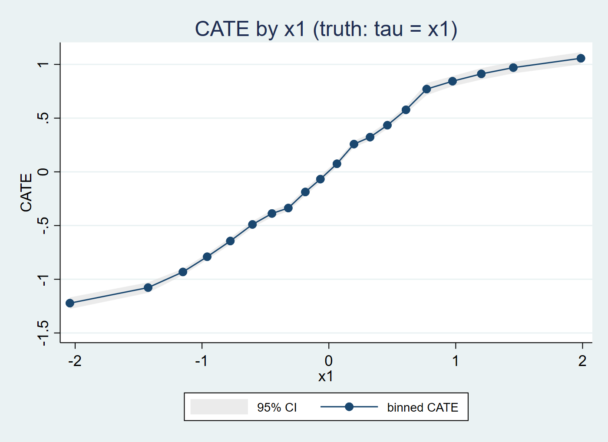
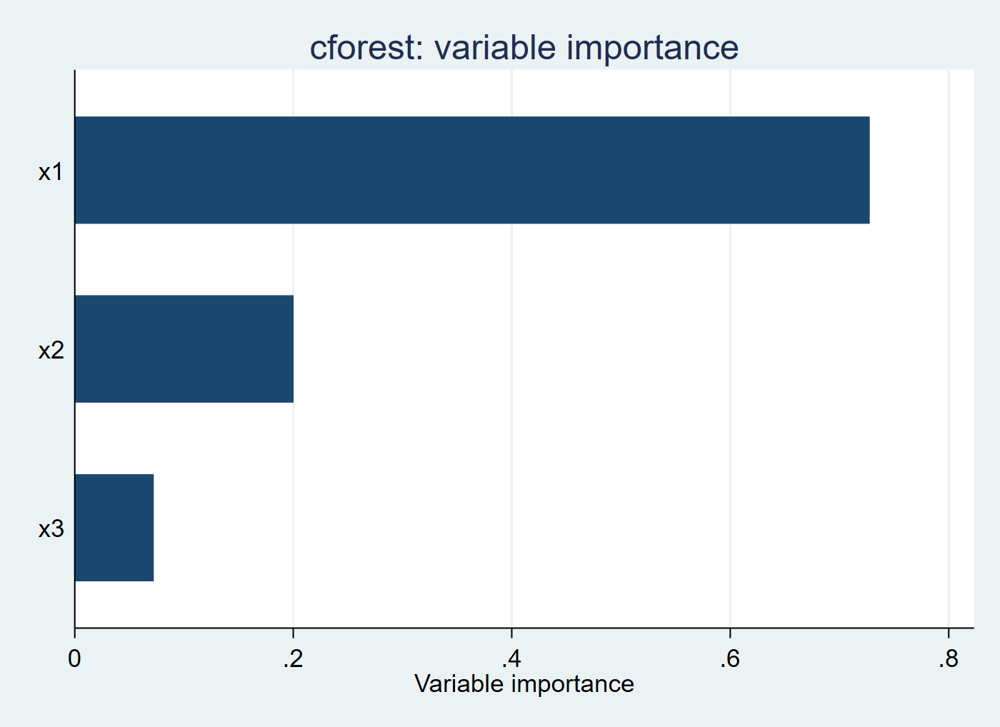

# cforest

[English](README.md) | [简体中文](README_zh.md)

**面向 Stata 的异质性处理效应因果森林**

[](https://www.stata.com/)
[](LICENSE)

> 状态：**v0.3.0（Stage A）**——用因果森林估计 CATE；支持样本外预测、最优线性
> 投影与变量重要性，并可绘制 CATE 曲线。已对拍 R `grf`。
> Stage B（原生 C++ 插件，零依赖）为剩余工作。

`cforest` 用**因果森林**估计**条件平均处理效应（CATE）**
τ(x) = E[Y(1) − Y(0) | X = x]，遵循 Wager & Athey (2018) 与 Athey、Tibshirani & Wager (2019)。

平均方法（回归、DiD）只给一个数字；因果森林告诉你效应如何随协变量变化。R `grf`
与 Python EconML/`skgrf` 都已存在，但 **Stata 没有可用实现**——本包填补这一空白。

## 架构

一个忠实的因果森林需要数千棵树 + 诚实切分 + 方差估计，纯 Mata 太慢。分两阶段：

- **Stage A（Python 桥）** —— ✅ **已完成**：经 Stata 内置 Python 集成调用
  `econml.grf.CausalForest`。
- **Stage B（原生插件）** —— ⏳ 待做（见 [`docs/stage-b.md`](docs/stage-b.md)）：
  把 `grf` 的 C++ 内核编译成 Stata 插件（SPI），实现零依赖。
  （`skgrf` 已证明该内核能脱离 R 复用。）

## 命令

```stata
cforest depvar indepvars [if] [in], treat(varname) ///
    [numtrees(#) minnodesize(#) seed(#) level(#) saving(filename) graph]

cforest_predict newvar [if] [in], [model(filename) level(#) lower(newvar) upper(newvar)]
cforest_blp [indepvars] [, level(#)]
cforest_plot, over(varname) [bins(#) level(#) title(string) saving(filename)]
```

- **`cforest`**：估计 τ̂(x)，生成 `cforest_tau`（CATE）、`cforest_tau_lb` /
  `cforest_tau_ub`（逐点界）与 `cforest_tau_oob`（袋外 CATE）；返回 `r(ate)`、
  `r(catt)`、`r(ate_oob)`、`r(importance)`、`r(covariates)`。
  `graph` 画变量重要性条形图；`saving()` 保存模型。
- **`cforest_predict`**：对新数据预测 CATE（复用最近模型或 `saving()` 保存的模型），
  可用 `lower()`/`upper()` 写出置信界。
- **`cforest_blp`**：报告 τ̂(x) 对协变量的最优线性投影（GRF 异质性汇总，稳健 SE）。
- **`cforest_plot`**：绘制分箱 CATE 曲线 + 置信带。

## 示例

```stata
cforest y x1 x2 x3, treat(w) numtrees(2000) seed(12345) saving(mymodel.joblib)
cforest_blp
cforest_plot, over(x1) saving(cate.png)
* ... 载入含 x1 x2 x3 的新数据 ...
cforest_predict tauhat, model(mymodel.joblib) lower(tau_lo) upper(tau_hi)
```

## 结果

估计的 CATE 随驱动异质性的协变量变化（真值：τ(x) = x₁）：



变量重要性：



## 验证（Stage A）

已知 CATE τ(x) = x₁ 的模拟数据（除注明外 1000 棵树）：

| 检查 | 结果 |
|---|---|
| 已知 CATE 恢复 | corr(τ̂, x₁) = **0.94** |
| 样本外预测（留出 500） | corr(τ̂, x₁) = **0.93** |
| 袋外 τ̂ | corr(τ̂_oob, x₁) = **0.94** |
| 对拍 R `grf`（`examples/reference/run_grf_check.R`） | corr(τ̂_cforest, τ̂_grf) = **0.97** |
| ATE / CATT（真值 = 0） | ≈ 0（R `grf` ATE = +0.0009） |
| 最优线性投影 | x₁ 斜率 = **0.70**，x₂/x₃ ≈ 0.02 / 0.01 |
| 变量重要性 | x₁ = **0.72**，x₂ = 0.21，x₃ = 0.07 |
| 可复现 | 同种子 → τ̂ 完全一致 |

x₁ 的 BLP 斜率**为正且占主导，但存在衰减**（0.70 vs 1）：森林估计 τ̂ 有噪声，
OLS 把 τ̂ 对 x₁ 回归会产生回归稀释（regression dilution）——`grf::best_linear_projection`
也有同样的注意事项。`grf`（C++ 内核）与 `econml.grf`（纯 Python）是两套实现，
所以是**定性一致**（都找回真 CATE），不是逐位相同。

测试：`examples/_test_cforest.do`、`examples/_test_predict.do`、
`examples/_test_extras.do`、`examples/_test_cforest_grf.do` +
`examples/reference/run_grf_check.R`。配图：`examples/cforest_figures.do`。

## 许可与署名

方法：Wager & Athey (2018)；Athey, Tibshirani & Wager (2019)。
`grf` 参考实现为 GPL-3；链接其内核的插件按 GPL/AGPL 分发。本包为 AGPL-3.0。

---

[English](README.md) | [简体中文](README_zh.md)
